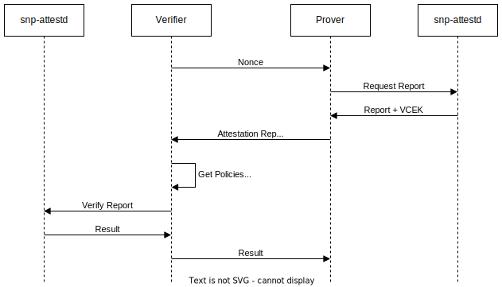

# IDSCP2 RA Driver - SEV-SNP

A IDSCP2 remote attestation driver implementation using SEV-SNP attestation reports.
Under the hood, the driver makes use of snp-attestd, a service that fetches and verifies attestation reports.

## Configuring the driver

### Prover

The Prover is configured using the [SnpProverConfig](src/main/kotlin/de/fhg/aisec/ids/snp/SnpProverConfig.kt) class.
The class provides a builder for easy construction:

```kotlin
/**
 * Set the X.509 certificate used during secure channel establishment.
 * This certificate will be used to bind the attestation report to this endpoint.
 */
fun setCertificate(value: X509Certificate): Builder

/**
 * Set the address used by snp-attestd.
 * This option overrides setSnpAttestdHost and setSnpAttestdPort.
 */
fun setSnpAttestdAddress(value: SocketAddress): Builder

/**
 * Set the hostname used by snp-attestd.
 * This option overrides setSnpAttestdAddress.
 */
fun setSnpAttestdHost(value: String): Builder

/**
 * Set the port used by snp-attestd.
 * This option overrides setSnpAttestdAddress.
 */
fun setSnpAttestdPort(value: Int): Builder

/**
 * Create the config.
 * At least setCertificate must be called beforehand.
 */
fun build(): SnpProverConfig
```

By default, snpAttestdAddress is set to `tcp:127.0.0.1:6778`.

### Verifier

The Verifier is configured using the [SnpVeriferConfig](src/main/kotlin/de/fhg/aisec/ids/snp/SnpVerifierConfig.kt) class.
This class can also be constructed using a builder object.
The builder has the same methods as the `SnpProverConfig` builder.

## Usage

The SNP Prover and Verifier can be used with the [JVM Implementation](https://github.com/industrial-data-space/idscp2-jvm) of the IDSCP2 protocol:

```kotlin
// Setup the Prover 
val proverConfig = SnpProverConfig.Builder()
    .setSnpAttestdHost("127.0.0.1")
    .setSnpAttestdPort(6778)
    .setCertificate(localCert)
    .build()

// Register the Prover with the prover registry
RaProverDriverRegistry.registerDriver(
    SnpProver.SNP_PROVER_DRIVER_ID,
    ::SnpProver,
    proverConfig
)

// Setup the Verifier
val verifierConfig = SnpVerifierConfig.Builder()
    .setSnpAttestdHost("127.0.0.1")
    .setSnpAttestdPort(6778)
    .setCertificate(localCert)
    .build()

// Register the Verifier with the verifier registry
RaVerifierDriverRegistry.registerDriver(
    SnpVerifier.SNP_VERIFIER_DRIVER_ID,
    ::SnpVerifier,
    verifierConfig
)

// Configure IDSCP2 to use the SNP driver
AttestationConfig.Builder()
    .setSupportedRaSuite(arrayOf(SnpProver.SNP_PROVER_DRIVER_ID))
    .setExpectedRaSuite(arrayOf(SnpVerifier.SNP_VERIFIER_DRIVER_ID))
    .build()
```

## The SNP Driver Protocol

||
|:-:|
|*Figure 1: The SNP attestation flow*|

In order to perform attestation, the SNP Verifier and Prover communicate over a custom communication protocol.
Messages are encoded using protocol buffers.
The message definitions can be found [here](src/main/proto/snp-verifier-prover.proto).

The Prover and Verifier both make use of snp-attestd to obtain and verify attestation reports.
snp-attestd exposes a grpc service defined [here](src/main/proto/snp-attestd-service.proto).

Figure 1 contains a high-level overview of the attestation process.

The Verifier begins the exchange by submitting a random value to the Prover as a challenge.

The Prover then calculates the SHA3-512 digest of the nonce, the Verifier's transport certificate and its own transport certificate. By including both certificates, the protocol guards against man in the middle attacks.
The Prover continues by requesting an SEV-SNP attestation report and associated VCEK certificate from from snp-attestd and forwarding them to the Verifier.

Upon receiving the attestation report from the Prover, the Verifier obtains a set of policies from the peers DAT.
These policies set constraints for the attestation report and are described in more detail [here](snp-attestd/policy/).
The Verifier then adds its own policy verifying, that the attestation report's report data contains the correct hash value.
The Verifier uses snp-attestd to check if the attestation report has a valid signature and conforms to the policies.

If the Verifier accepts the report, it notifies the Prover and completes successfully.